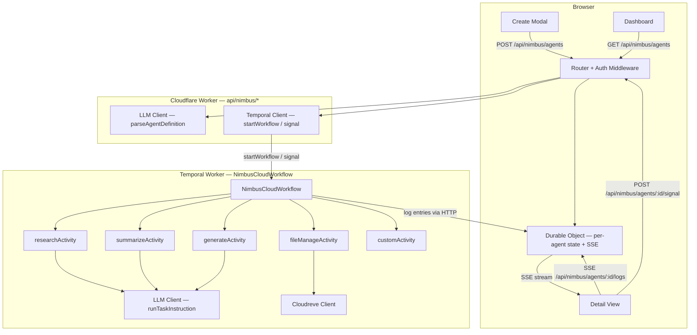

# Design Document — mini-NimbusClouds

## Overview

mini-NimbusClouds adds persistent, background AI agents to the existing NimbusAI platform. Each agent ("mini-NimbusCloud") is defined by a natural-language description that is parsed by the GPT OSS 120B model into a structured `AgentDefinition`. The definition drives a Temporal.io workflow (`NimbusCloudWorkflow`) that executes a list of `AgentTask` items, calling LLM and file-system tools as needed. A Cloudflare Worker acts as the API gateway; a Cloudflare Durable Object holds per-agent edge state and fans out live log entries to the frontend via SSE. The Next.js frontend gains a Create modal, a Dashboard page, and a Detail view, all wired to the existing Tailwind/Radix design system.

The feature is deliberately scoped to work within the existing Next.js App Router project. The CF Worker and Temporal Worker are separate deployable units but share a `types/nimbus.ts` file that is the single source of truth for all data contracts.

---

## Architecture



The Next.js API routes at `/api/nimbus/*` are **thin proxies** — they validate the session with `next-auth`, then forward requests to the CF Worker. This keeps auth in one place (Next.js) while the CF Worker handles Temporal and Durable Object interactions.

---

## Components and Interfaces

### 1. `types/nimbus.ts` — Shared Types

Single file imported by CF Worker, Temporal Worker, and Next.js frontend.

### 2. `lib/llmClient.ts` — LLM Client

Wraps the DigitalOcean GPT OSS 120B OpenAI-compatible endpoint. Reads `DO_INFERENCE_URL` and `DO_INFERENCE_API_KEY` from environment. Exposes:

- `parseAgentDefinition(nl: string, userId: string): Promise<AgentDefinition>`
- `runTaskInstruction(task: AgentTask, context: string): Promise<string>`
- `webFetch(url: string): Promise<string>` (tool wrapper)
- `cloudreve_listFiles(path: string): Promise<string>` (tool wrapper)
- `cloudreve_writeFile(path: string, content: string): Promise<void>` (tool wrapper)

### 3. `lib/cloudreveClient.ts` — Cloudreve Client

Extends the existing `lib/cloudreve.ts` admin-token cache. Exposes the full CRUD surface required by Temporal Activities:

- `listFiles`, `getFile`, `uploadFile`, `createFolder`, `deleteFile`, `moveFile`

### 4. CF Worker (`workers/nimbus/index.ts`)

Handles all `/api/nimbus/*` routes. Uses `itty-router` for routing. Each route handler:
1. Validates the `Authorization: Bearer <session-token>` header (forwarded from Next.js proxy).
2. Calls the appropriate Temporal client method or Durable Object stub.
3. Returns a typed JSON response.

### 5. Durable Object (`workers/nimbus/AgentDO.ts`)

One instance per agent (`agentId` as the DO name). Stores:
- `definition: AgentDefinition` — latest snapshot
- `logs: LogEntry[]` — ring buffer (max 500 entries)
- `sseClients: Set<WritableStreamDefaultWriter>` — active SSE connections

Handles:
- `POST /do/log` — append log entry, broadcast to SSE clients
- `GET /do/sse` — upgrade to SSE, stream buffered + live logs
- `GET /do/state` — return current definition snapshot
- `PATCH /do/state` — update definition fields (status, task results)

### 6. Temporal Worker (`temporal/worker.ts` + `temporal/workflows/NimbusCloudWorkflow.ts`)

Registers the workflow and all five activities. Connects to Temporal Cloud (or self-hosted) via `TEMPORAL_ADDRESS` and `TEMPORAL_NAMESPACE` env vars.

### 7. Next.js API Proxy Routes (`app/api/nimbus/`)

Thin session-validated proxies:
- `app/api/nimbus/agents/route.ts` — GET + POST
- `app/api/nimbus/agents/[id]/signal/route.ts` — POST
- `app/api/nimbus/agents/[id]/logs/route.ts` — GET (SSE passthrough)
- `app/api/nimbus/webhooks/[agentId]/route.ts` — POST
- `app/api/nimbus/health/route.ts` — GET

### 8. Frontend Components

- `components/nimbus/CreateModal.tsx` — creation form
- `components/nimbus/Dashboard.tsx` — card grid
- `components/nimbus/AgentCard.tsx` — single card with controls
- `components/nimbus/DetailView.tsx` — full detail drawer/page
- `components/nimbus/LogStream.tsx` — SSE log consumer
- `components/nimbus/TaskList.tsx` — per-task status list

---

## Data Models

```typescript
// types/nimbus.ts

export type TriggerType = 'manual' | 'scheduled' | 'event';
export type IntegrationType = 'cloudreve' | 'github' | 'web' | 'custom';
export type AgentStatus = 'running' | 'paused' | 'completed' | 'failed';
export type TaskType = 'research' | 'summarize' | 'generate' | 'file_manage' | 'custom';
export type TaskStatus = 'pending' | 'running' | 'completed' | 'failed';

export interface AgentTask {
  id: string;                        // uuid, assigned at parse time
  type: TaskType;
  instruction: string;
  inputSource?: string;              // URL, file path, or task id whose output feeds this task
  outputTarget?: string;             // file path or "return"
  status: TaskStatus;
  result?: string;                   // populated on completion or failure
  attempt: number;                   // current retry attempt (1-indexed)
  durationMs?: number;
}

export interface AgentDefinition {
  id: string;                        // cuid, assigned by CF Worker on creation
  userId: string;
  name: string;
  description: string;
  tasks: AgentTask[];
  trigger: TriggerType;
  schedule?: string;                 // cron expression, only when trigger === 'scheduled'
  integrations: IntegrationType[];
  status: AgentStatus;
  createdAt: string;                 // ISO 8601
  updatedAt: string;                 // ISO 8601
}

// ── API shapes ────────────────────────────────────────────────────────────────

export interface CreateAgentRequest {
  name: string;
  description: string;              // natural-language input
  trigger: TriggerType;
  schedule?: string;
  integrations: IntegrationType[];
}

export interface SignalRequest {
  signal: 'pause' | 'resume' | 'cancel' | 'addTask';
  task?: AgentTask;                  // required when signal === 'addTask'
}

export interface ApiError {
  code: string;
  message: string;
  requestId: string;
}

export interface LogEntry {
  ts: string;                        // ISO 8601
  agentId: string;
  taskId?: string;
  taskType?: TaskType;
  attempt?: number;
  event: 'activity_start' | 'activity_complete' | 'activity_fail' | 'workflow_complete' | 'workflow_fail' | 'signal';
  message: string;
  durationMs?: number;
}
```

### Prisma Schema Addition

The existing `NimbusCloudAgent` model is extended with a `temporal_workflow_id` column and a `tasks` JSON column to persist the full `AgentDefinition` server-side:

```prisma
model NimbusCloudAgent {
  // ... existing fields ...
  temporal_workflow_id String?
  tasks                String  @default("[]")  // JSON-serialised AgentTask[]
  integrations         String  @default("[]")  // JSON-serialised IntegrationType[]
  trigger              String  @default("manual")
}
```

The Next.js proxy routes read/write this model so the dashboard can hydrate without hitting the CF Worker on every page load.

---

## API Contract

All routes are prefixed `/api/nimbus/` and served by the CF Worker. The Next.js proxy routes forward requests after attaching the authenticated `userId` in a `X-Nimbus-User-Id` header.

### `POST /api/nimbus/agents`

**Request**
```json
{
  "name": "Competitor Price Monitor",
  "description": "Every hour, fetch pricing pages for CompA and CompB, summarise changes, and save to Cloudreve.",
  "trigger": "scheduled",
  "schedule": "0 * * * *",
  "integrations": ["web", "cloudreve"]
}
```

**Response 201**
```json
{
  "agent": { /* AgentDefinition */ }
}
```

**Response 400** — missing required field
```json
{ "code": "VALIDATION_ERROR", "message": "Missing required field: name", "requestId": "req_abc123" }
```

### `GET /api/nimbus/agents`

**Response 200**
```json
{ "agents": [ /* AgentDefinition[] */ ] }
```

### `POST /api/nimbus/agents/:id/signal`

**Request**
```json
{ "signal": "pause" }
```
or for `addTask`:
```json
{
  "signal": "addTask",
  "task": { "type": "research", "instruction": "Also check CompC pricing", "status": "pending", "attempt": 0 }
}
```

**Response 200**
```json
{ "ok": true }
```

### `GET /api/nimbus/agents/:id/logs` (SSE)

Upgrades to an SSE stream. Each event is a JSON-serialised `LogEntry`:
```
data: {"ts":"2025-01-01T00:00:00Z","agentId":"...","event":"activity_start","message":"Starting research task"}

```

### `POST /api/nimbus/webhooks/:agentId`

Accepts any JSON body. Forwards it as a Temporal `event` signal to the workflow.

**Response 202**
```json
{ "ok": true }
```

### `GET /api/nimbus/health`

**Response 200** (all healthy)
```json
{ "status": "ok", "timestamp": "2025-01-01T00:00:00Z" }
```

**Response 503** (degraded)
```json
{
  "status": "degraded",
  "details": { "temporal": "unreachable", "llm": "ok", "cloudreve": "ok" },
  "timestamp": "2025-01-01T00:00:00Z"
}
```

---

## Temporal Workflow Design

### `NimbusCloudWorkflow`

```typescript
// temporal/workflows/NimbusCloudWorkflow.ts (pseudocode)

export async function NimbusCloudWorkflow(def: AgentDefinition): Promise<void> {
  let paused = false;
  let cancelled = false;
  const pendingTasks = [...def.tasks];

  // Signal handlers
  setHandler(pauseSignal,   () => { paused = true; });
  setHandler(resumeSignal,  () => { paused = false; });
  setHandler(cancelSignal,  () => { cancelled = true; });
  setHandler(addTaskSignal, (task: AgentTask) => { pendingTasks.push(task); });

  while (pendingTasks.length > 0 && !cancelled) {
    // Honour pause: block until resumed
    await condition(() => !paused || cancelled);
    if (cancelled) break;

    // Identify the next runnable batch (tasks with no unresolved inputSource)
    const batch = getParallelBatch(pendingTasks);
    pendingTasks.splice(0, batch.length);

    await Promise.all(batch.map(task => executeTask(task, def)));
  }

  // Report final status to Durable Object
  const finalStatus = cancelled ? 'failed' : 'completed';
  await notifyDurableObject(def.id, finalStatus);
}
```

**Retry policy** applied to every Activity:
```typescript
{
  maximumAttempts: 3,
  initialInterval: '5s',
  backoffCoefficient: 2,
  maximumInterval: '30s',
}
```

**Parallel batch detection**: tasks whose `inputSource` is `undefined` or references only already-completed task IDs are eligible to run in parallel. This is evaluated at the start of each loop iteration.

**Signal handlers** are registered before the main loop so signals arriving during Activity execution are buffered by Temporal and applied at the next safe point.

### Activities

| Activity | Input | Output | Tool calls |
|---|---|---|---|
| `researchActivity` | `AgentTask`, context string | result string | `webFetch`, `runTaskInstruction` |
| `summarizeActivity` | `AgentTask`, context string | result string | `runTaskInstruction` |
| `generateActivity` | `AgentTask`, context string | result string | `runTaskInstruction` |
| `fileManageActivity` | `AgentTask`, context string | result string | `cloudreve_*` methods |
| `customActivity` | `AgentTask`, context string | result string | `runTaskInstruction` |

Each activity emits a structured `LogEntry` at start, completion, and failure via an HTTP POST to the Durable Object's `/do/log` endpoint.

---

## Durable Object Design

### State Shape

```typescript
interface DOState {
  definition: AgentDefinition;
  logs: LogEntry[];          // ring buffer, max 500
}
```

State is persisted via the Durable Object's built-in `storage.put` / `storage.get` API so it survives DO hibernation.

### SSE Streaming

```
Browser                    Durable Object
  |                              |
  |-- GET /do/sse -------------> |
  |                              | (upgrade to SSE, flush buffered logs)
  |<-- data: LogEntry ---------- |
  |<-- data: LogEntry ---------- |
  |                              |
  |   (Temporal Activity runs)   |
  |                              |
  |          POST /do/log -----> |
  |                              | (append to ring buffer)
  |<-- data: LogEntry ---------- | (broadcast to all SSE clients)
```

When a new SSE client connects, the DO immediately flushes the last 100 buffered log entries before switching to live streaming. This ensures the Detail View shows history even if the user opens it mid-run.

### Fetch Handler

```
GET  /do/sse      → SSE upgrade
POST /do/log      → append + broadcast
GET  /do/state    → return AgentDefinition snapshot
PATCH /do/state   → update status / task results
```

---

## Frontend Component Tree

```
app/nimbus/
  page.tsx                  ← Dashboard page (server component shell)
  [id]/
    page.tsx                ← Detail view page

components/nimbus/
  CreateModal.tsx           ← Radix Dialog, controlled by Dashboard
  Dashboard.tsx             ← card grid, polls GET /api/nimbus/agents every 10s
  AgentCard.tsx             ← single card: name, status badge, progress bar, controls
  DetailView.tsx            ← drawer/sheet: task list + log stream + results
  LogStream.tsx             ← SSE consumer, renders LogEntry list
  TaskList.tsx              ← per-task status with retry button
```

### CreateModal

Fields:
1. Agent name (text input, required)
2. Description (textarea, required — natural language)
3. Trigger type (radio: Manual / Scheduled / Event-Driven)
4. Cron expression (text input, shown only when trigger = Scheduled)
5. Integrations (checkbox group: Cloudreve / Web Research / GitHub Repo / URL/Doc / Custom)
6. "Launch Agent" button

On submit: `POST /api/nimbus/agents`. On success: close modal, optimistically prepend new card to Dashboard. On error: display `ApiError.message` inline.

### Dashboard

- Fetches agents on mount and every 10 seconds via `setInterval`.
- Renders `AgentCard` for each agent.
- Running agents show an animated pulse ring (Tailwind `animate-pulse`).
- Failed agents show a red border and the first failed task's error message.
- "New Agent" button opens `CreateModal`.

### AgentCard

Controls:
- Pause / Resume → `POST /api/nimbus/agents/:id/signal` `{ signal: 'pause' | 'resume' }`
- Cancel → `POST /api/nimbus/agents/:id/signal` `{ signal: 'cancel' }`
- Clone → opens `CreateModal` pre-filled with the agent's definition
- Add Task → inline mini-form, submits `{ signal: 'addTask', task: {...} }`
- Click card body → opens `DetailView`

### DetailView

Three tabs:
1. **Tasks** — `TaskList` component, per-task status chip, result preview, "Retry Task" button for failed tasks
2. **Logs** — `LogStream` component consuming SSE from `/api/nimbus/agents/:id/logs`
3. **Integrations** — read-only list of configured `IntegrationType` values

### LogStream

```typescript
// Simplified SSE consumer
useEffect(() => {
  const es = new EventSource(`/api/nimbus/agents/${agentId}/logs`);
  es.onmessage = (e) => setLogs(prev => [...prev, JSON.parse(e.data)]);
  return () => es.close();
}, [agentId]);
```

Auto-scrolls to bottom. Colour-codes entries: `activity_fail` → red, `activity_complete` → green, others → gray.

---

## Error Handling Strategy

### CF Worker

All route handlers are wrapped in a top-level `try/catch`. Errors are mapped to the `ApiError` envelope:

```typescript
function errorResponse(code: string, message: string, requestId: string, status: number): Response {
  return Response.json({ code, message, requestId }, { status });
}
```

Standard error codes:
| Code | HTTP | Meaning |
|---|---|---|
| `UNAUTHORIZED` | 401 | Missing or invalid session token |
| `VALIDATION_ERROR` | 400 | Missing/invalid request field |
| `NOT_FOUND` | 404 | Agent ID not found |
| `TEMPORAL_ERROR` | 502 | Temporal client call failed |
| `LLM_ERROR` | 502 | GPT endpoint returned non-2xx |
| `CLOUDREVE_ERROR` | 502 | Cloudreve returned non-zero code |
| `INTERNAL_ERROR` | 500 | Unexpected error |

### Temporal Worker

- Each Activity wraps its logic in `try/catch` and re-throws as `ApplicationFailure` with a typed `type` field.
- `NimbusCloudWorkflow` catches `ActivityFailure` after retries are exhausted, writes the error message to `task.result`, sets `task.status = 'failed'`, and POSTs a `LogEntry` with `event: 'activity_fail'` to the Durable Object.
- The workflow continues with remaining tasks unless `cancelled`.

### LLM Client

Throws `LlmError` (extends `Error`) with `statusCode: number` and `body: string` when the endpoint returns non-2xx.

### Cloudreve Client

Throws `CloudreveError` (extends `Error`) with `code: number` and `msg: string` when the response body has `code !== 0`.

### Frontend

- `CreateModal` catches fetch errors and displays them inline below the form.
- `Dashboard` shows a toast (Radix `Toast`) on signal errors.
- `LogStream` shows a reconnecting indicator if the SSE connection drops, and retries with exponential backoff (1s, 2s, 4s, max 30s).

---

## Correctness Properties

*A property is a characteristic or behavior that should hold true across all valid executions of a system — essentially, a formal statement about what the system should do. Properties serve as the bridge between human-readable specifications and machine-verifiable correctness guarantees.*

### Property 1: AgentDefinition serialisation round-trip

*For any* valid `AgentDefinition` object, serialising it to JSON and deserialising it back SHALL produce a structurally equivalent object (same field values, same task array length and content).

**Validates: Requirements 3.1, 3.2, 5.7**

### Property 2: parseAgentDefinition always produces at least one task

*For any* non-empty natural-language description string, `parseAgentDefinition` SHALL return an `AgentDefinition` whose `tasks` array contains at least one `AgentTask`.

**Validates: Requirements 5.2, 5.7**

### Property 3: Validation rejects definitions with missing required fields

*For any* `AgentDefinition`-shaped object that is missing one or more required fields (`id`, `userId`, `name`, `description`, `tasks`, `trigger`, `integrations`, `status`, `createdAt`), the CF Worker's validation function SHALL return a `VALIDATION_ERROR` and SHALL NOT start a Temporal workflow.

**Validates: Requirements 3.3, 3.4**

### Property 4: Signal round-trip preserves task queue length

*For any* running `NimbusCloudWorkflow` with N pending tasks, sending a `pause` signal followed immediately by a `resume` signal SHALL result in the workflow continuing with the same N pending tasks (no tasks lost or duplicated).

**Validates: Requirements 4.4, 4.5, 4.6**

### Property 5: addTask signal grows the pending queue

*For any* running `NimbusCloudWorkflow` with N pending tasks, sending an `addTask` signal with a valid `AgentTask` SHALL result in the workflow having N+1 pending tasks.

**Validates: Requirements 4.8**

### Property 6: Log entry broadcast reaches all SSE clients

*For any* Durable Object instance with K active SSE connections, posting a `LogEntry` to `/do/log` SHALL result in all K clients receiving exactly one SSE event containing that log entry.

**Validates: Requirements 2.9, 7.5**

### Property 7: Cloudreve client upload/download round-trip

*For any* byte buffer of arbitrary content and MIME type, uploading it via `cloudreveClient.uploadFile` and then downloading it via `cloudreveClient.getFile` SHALL return a buffer byte-for-byte identical to the original.

**Validates: Requirements 6.3, 6.2**

---

## Testing Strategy

### Unit Tests (Vitest)

Focus on pure logic:
- `types/nimbus.ts` — schema validation helpers
- `lib/llmClient.ts` — request construction, error mapping (mock fetch)
- `lib/cloudreveClient.ts` — token reuse, error mapping (mock fetch)
- CF Worker route handlers — request parsing, validation, error envelopes (mock Temporal client + DO stub)
- `NimbusCloudWorkflow` — signal handler logic, parallel batch detection (Temporal test environment)

### Property-Based Tests (fast-check, minimum 100 iterations each)

Each property test is tagged with a comment referencing the design property:
```typescript
// Feature: mini-nimbus-clouds, Property 1: AgentDefinition serialisation round-trip
```

- **Property 1**: Generate arbitrary `AgentDefinition` objects, serialise → deserialise, assert deep equality.
- **Property 2**: Generate arbitrary non-empty strings, call `parseAgentDefinition` with a mocked LLM that returns valid JSON, assert `tasks.length >= 1`.
- **Property 3**: Generate `AgentDefinition`-shaped objects with one required field randomly removed, assert validation returns `VALIDATION_ERROR`.
- **Property 4**: Simulate workflow state with arbitrary N pending tasks, apply pause+resume, assert queue length unchanged.
- **Property 5**: Simulate workflow state with arbitrary N pending tasks, apply addTask, assert queue length is N+1.
- **Property 6**: Simulate DO with arbitrary K SSE clients, post a log entry, assert all K clients received it.
- **Property 7**: Generate arbitrary `Buffer` values, mock Cloudreve upload/download, assert round-trip equality.

### Integration Tests

- End-to-end: `POST /api/nimbus/agents` → Temporal workflow starts → first activity runs → log entry appears in SSE stream.
- Health check: `GET /api/nimbus/health` returns `ok` when all dependencies are reachable, `degraded` when one is mocked to fail.

### SSE / UI Tests

- `LogStream` component: mock `EventSource`, assert entries render in order and auto-scroll fires.
- `CreateModal`: submit with missing fields → inline error; submit with valid fields → modal closes.
